# Prisma — Tara Brooch Management System

## Codebase Documentation

> **Audience:** Technical developers, product managers, and business stakeholders.
> **Last Updated:** January 2026

---

## Table of Contents

1. [Executive Summary](#1-executive-summary)
2. [System Architecture](#2-system-architecture)
3. [Tech Stack](#3-tech-stack)
4. [Project Structure](#4-project-structure)
5. [Modules Overview](#5-modules-overview)
6. [Data Flow & Call Patterns](#6-data-flow--call-patterns)
7. [API Reference](#7-api-reference)
8. [Authentication & Authorization](#8-authentication--authorization)
9. [Configuration System](#9-configuration-system)
10. [Frontend Components](#10-frontend-components)
11. [Backend (Lambda Functions)](#11-backend-lambda-functions)
12. [Database Schema (Notion)](#12-database-schema-notion)
13. [Styling & Design System](#13-styling--design-system)
14. [Deployment & Hosting](#14-deployment--hosting)
15. [Limitations & Known Constraints](#15-limitations--known-constraints)
16. [Boundaries of Concern](#16-boundaries-of-concern)
17. [Future Roadmap](#17-future-roadmap)
18. [Glossary](#18-glossary)

---

## 1. Executive Summary

**Prisma** is a custom-built jewelry order management and expense tracking system for **Tara Brooch**, a Mexican jewelry business. It manages the full lifecycle of custom jewelry orders — from creation through production to delivery — alongside business expenses, gold inventory, and supplier tracking.

### What It Does (Non-Technical)

| Capability | Description |
|---|---|
| **Order Management** | Create, track, and update custom jewelry orders with customer details, pricing, and delivery dates |
| **Expense Tracking** | Record, categorize, and monitor all business spending with multi-currency support |
| **Gold Inventory** | Track gold given to and returned from jewelry makers (joyeros) |
| **Order Search** | Search historical orders by customer name or order number |
| **Receipt Printing** | Generate receipts for customers on a dot-matrix printer |
| **Multi-View Dashboard** | View data as cards, Kanban boards, calendars, or charts |

### Key Numbers

| Metric | Value |
|---|---|
| HTML Pages | 7 |
| JavaScript Files | 21 |
| CSS Files | 5 |
| Lambda Functions | 5 |
| Supported Order Types | 12 |
| Vendedoras (Salespeople) | 5 |
| Joyeros (Craftspeople) | 6 |
| Proveedores (Suppliers) | 8 |
| Expense Categories | 8 (with 30+ subcategories) |

---

## 2. System Architecture

### High-Level Architecture

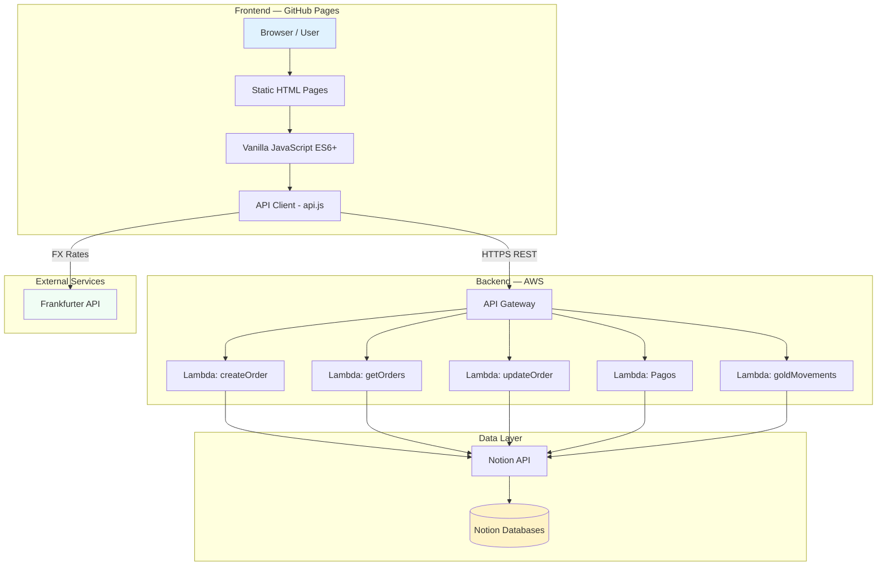

### Request Lifecycle

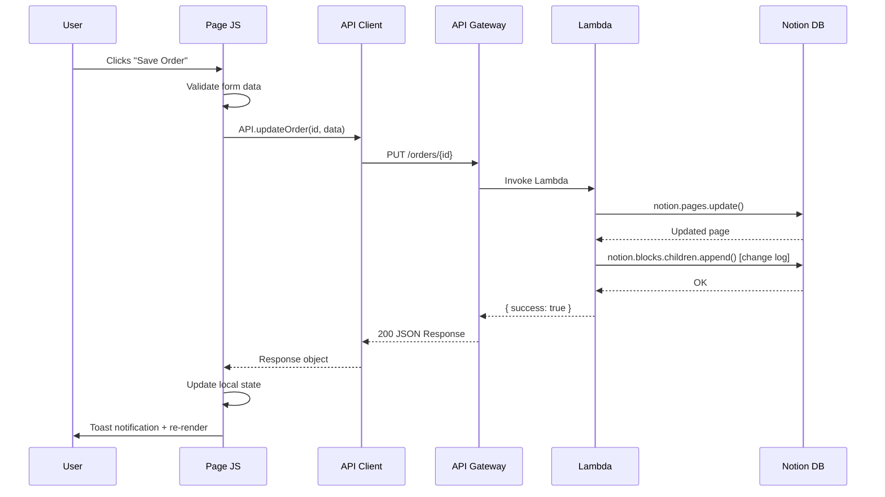

---

## 3. Tech Stack

### Frontend

| Technology | Purpose | Notes |
|---|---|---|
| **HTML5** | Page structure | Semantic markup, 7 standalone pages |
| **Vanilla JavaScript (ES6+)** | Application logic | No framework (React, Vue, etc.) |
| **CSS3 + Custom Properties** | Styling | Hand-coded design system, CSS variables for theming |
| **Inter (Google Fonts)** | Typography | Clean, modern sans-serif |
| **SVG Icons** | Iconography | Inline SVGs, 24x24px standard |

### Backend

| Technology | Purpose | Notes |
|---|---|---|
| **AWS Lambda** | Serverless API functions | 5 functions, Node.js runtime |
| **AWS API Gateway** | REST API exposure | Single endpoint, routes by path |
| **Notion API** | Database operations | `@notionhq/client` v2.2.15 SDK |
| **Node.js** | Lambda runtime | ES modules (`.mjs`) for most functions |

### External Services

| Service | Purpose | Cost |
|---|---|---|
| **GitHub Pages** | Frontend hosting | Free |
| **AWS Lambda** | Backend compute | Free tier (1M requests/month) |
| **Notion** | Database storage | Free (with API integration) |
| **Frankfurter API** | USD/MXN exchange rates | Free, no API key required |

### What Is NOT Used

- No frontend framework (React, Vue, Angular)
- No build tools (Webpack, Vite, Rollup)
- No CSS preprocessors (Sass, Less)
- No package manager on frontend (npm, yarn)
- No local database (PostgreSQL, MongoDB)
- No ORM or query builder
- No TypeScript

---

## 4. Project Structure

```
tarabrooch.github.io/
├── index.html                  # Login page & main menu
├── pedidos.html                # Orders dashboard (list/kanban/calendar)
├── nuevo-pedido.html           # New order creation form
├── buscar-pedido.html          # Order search (including archived)
├── pagos.html                  # Expenses dashboard (list/kanban/calendar/chart)
├── nuevo-pago.html             # New expense entry form
├── joyeros.html                # Gold inventory per jeweler
│
├── css/
│   ├── styles.css              # Global design system & shared styles
│   ├── pedidos.css             # Orders page styles
│   ├── pagos.css               # Expenses page styles
│   ├── joyeros.css             # Gold tracking styles
│   └── buscar-pedido.css       # Search page styles
│
├── js/
│   ├── config.js               # Central configuration (frozen objects)
│   ├── api.js                  # API client wrapper for all endpoints
│   ├── auth.js                 # Session-based authentication
│   ├── utils.js                # Shared utilities (dates, currency, DOM, etc.)
│   ├── mock-data.js            # Development mock data (~1200 lines)
│   │
│   ├── components/             # Reusable UI components
│   │   ├── order-card.js       # Order card rendering with urgency indicators
│   │   ├── edit-modal.js       # Order edit form modal
│   │   ├── kanban.js           # Kanban board component
│   │   ├── calendar.js         # Calendar view component
│   │   ├── pago-card.js        # Expense card rendering
│   │   ├── pago-edit-modal.js  # Expense edit form modal
│   │   ├── pago-calendar.js    # Expense calendar with aggregation
│   │   ├── pago-graph.js       # Expense chart visualization
│   │   └── desglose-modal.js   # Payment breakdown (desglose) modal
│   │
│   └── pages/                  # Page-specific logic
│       ├── pedidos.js          # Orders page controller
│       ├── nuevo-pedido.js     # New order form handler
│       ├── pagos.js            # Expenses page controller
│       ├── nuevo-pago.js       # New expense form handler
│       ├── joyeros.js          # Gold tracking controller
│       └── buscar-pedido.js    # Search page controller
│
├── lambda/                     # AWS Lambda function source code
│   ├── prisma_createOrder/     # POST /orders
│   │   ├── index.mjs
│   │   └── package.json
│   ├── prisma_getOrders/       # GET /orders, GET /orders/search
│   │   ├── index.mjs
│   │   └── package.json
│   ├── prisma_updateOrder/     # PUT /orders/{id}
│   │   ├── index.mjs
│   │   └── package.json
│   ├── prisma_Pagos/           # Full CRUD for /pagos
│   │   ├── index.mjs
│   │   └── package.json
│   └── prisma_goldMovements/   # /gold-movements, /joyeros/balances
│       ├── index.js
│       └── package.json
│
├── archive/                    # Deprecated gold tracking components
├── prisma_v2_plan.md           # Future expansion roadmap (Supabase migration)
└── .gitignore
```

---

## 5. Modules Overview

The application is organized into four functional modules:

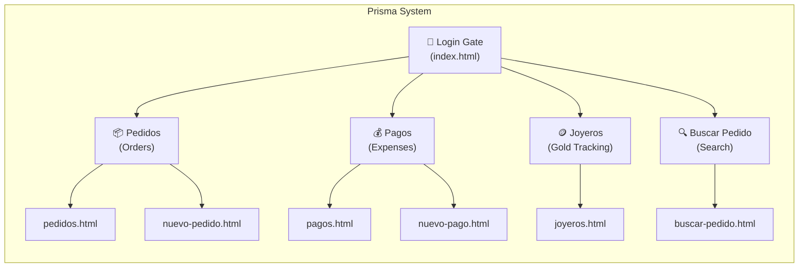

### Module Details

| Module | Pages | Purpose | Key Features |
|---|---|---|---|
| **Pedidos** (Orders) | `pedidos.html`, `nuevo-pedido.html` | Manage custom jewelry orders | 3 views (List, Kanban, Calendar), urgency indicators, edit modal, change logging, auto gold deduction |
| **Pagos** (Expenses) | `pagos.html`, `nuevo-pago.html` | Track business spending | 4 views (List, Kanban, Calendar, Graph), USD/MXN conversion, desglose (breakdown), fiscal flag |
| **Joyeros** (Gold) | `joyeros.html` | Track gold inventory per jeweler | Balance cards, movement history, entry/exit recording, password-protected creation |
| **Buscar** (Search) | `buscar-pedido.html` | Search all orders (including archived) | Full-text search, Notion page content display, detail modal |

---

## 6. Data Flow & Call Patterns

### Pattern 1: Page Load (Read Operations)

Every page follows the same initialization pattern:

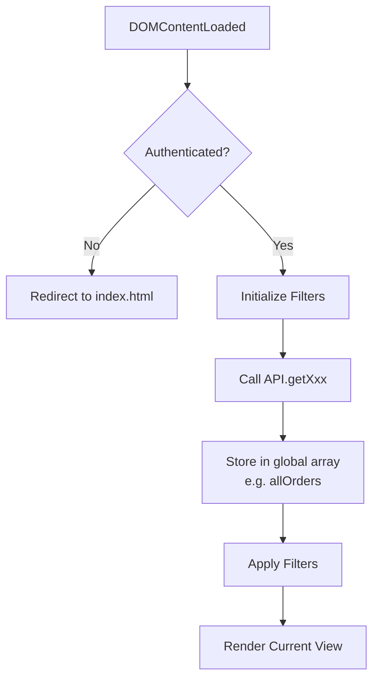

**Code Pattern:**
```
Page Load → Auth Check → Init Filters → API.get*() → Store in memory → Filter → Render
```

### Pattern 2: Create Operations

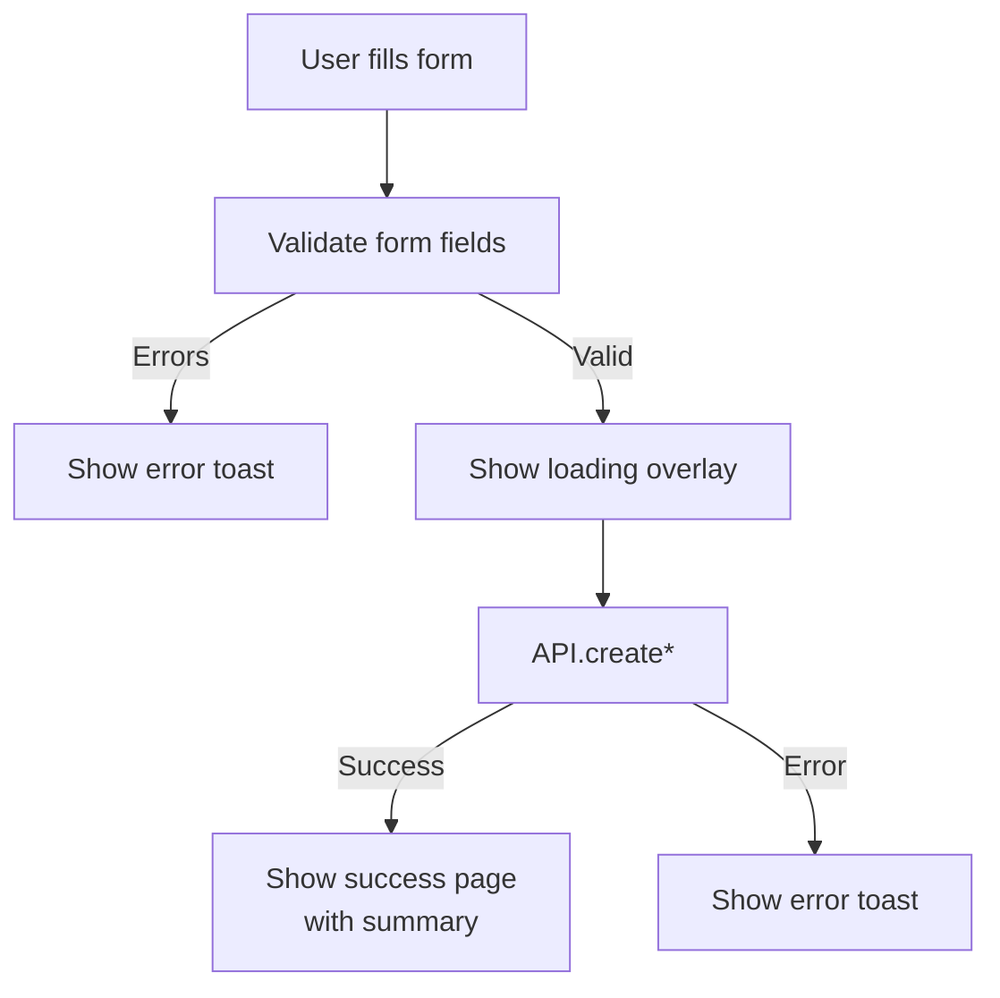

### Pattern 3: Update Operations (Edit Modal)

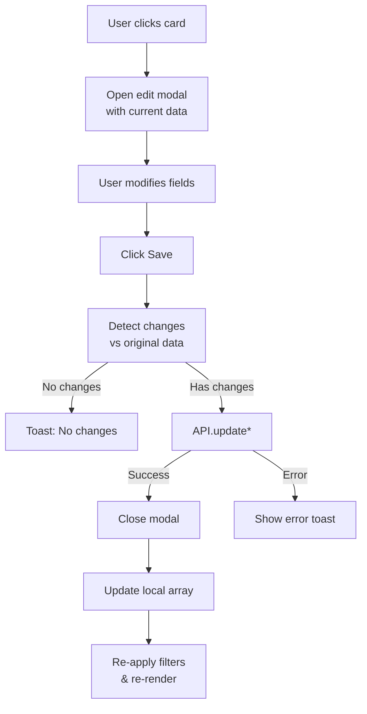

### Pattern 4: Auto Gold Deduction

When an order's status changes to "En Producción", gold is automatically deducted from the assigned jeweler:

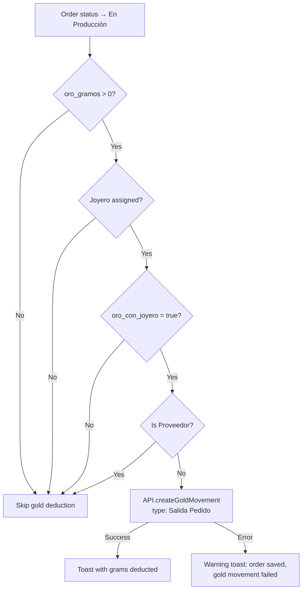

### State Management Pattern

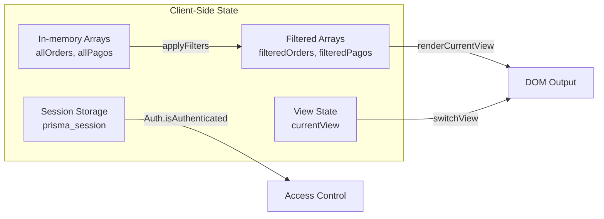

**Key Principle:** The frontend holds all loaded data in-memory arrays. Filtering and sorting happen client-side. There is no client-side cache persisted across page loads — data is fetched fresh each time a page loads.

---

## 7. API Reference

All API calls go through the `API` object defined in `js/api.js`. The base URL is an AWS API Gateway endpoint.

### Orders Endpoints

| Method | Endpoint | Function | Description |
|---|---|---|---|
| `POST` | `/orders` | `API.createOrder(data)` | Create a new order |
| `GET` | `/orders` | `API.getOrders(filters)` | List orders (excludes closed) |
| `GET` | `/orders?q={query}` | `API.searchOrders(query)` | Search all orders (includes closed) |
| `GET` | `/orders/{id}` | `API.getOrder(id)` | Get single order by ID |
| `PUT` | `/orders/{id}` | `API.updateOrder(id, data, user, changes)` | Update order properties + log changes |
| `POST` | `/orders/{id}/approve` | `API.approveOrder(id, data)` | Approve an order (admin) |
| `GET` | `/orders/{id}/content` | `API.getOrderPageContent(id)` | Get Notion page blocks |

### Pagos Endpoints

| Method | Endpoint | Function | Description |
|---|---|---|---|
| `POST` | `/pagos` | `API.createPago(data)` | Create a new expense |
| `GET` | `/pagos` | `API.getPagos(filters)` | List expenses |
| `GET` | `/pagos/{id}` | `API.getPago(id)` | Get single expense |
| `PUT` | `/pagos/{id}` | `API.updatePago(id, data, user, changes)` | Update expense + log changes |
| `GET` | `/pagos/{id}/desglose` | `API.getDesglose(id)` | Get payment breakdown items |
| `PUT` | `/pagos/{id}/desglose` | `API.updateDesglose(id, items)` | Update payment breakdown |

### Gold Movements Endpoints

| Method | Endpoint | Function | Description |
|---|---|---|---|
| `GET` | `/gold-movements` | `API.getGoldMovements(filters)` | List gold movements |
| `POST` | `/gold-movements` | `API.createGoldMovement(data)` | Record a gold movement |
| `GET` | `/joyeros/balances` | `API.getJoyeroBalances()` | Get gold balance per jeweler |

### FX Rate

| Method | Endpoint | Function | Description |
|---|---|---|---|
| `GET` | `frankfurter.app/latest?from=USD&to=MXN` | `API.getFxRate()` | Get live USD/MXN rate (fallback: 19.10) |

### Standard API Response Format

All Lambda functions return this structure:

```json
{
  "success": true,
  "data": { ... },
  "has_more": false,
  "next_cursor": null
}
```

On error:

```json
{
  "success": false,
  "error": "Human-readable error message",
  "details": "Technical error details"
}
```

---

## 8. Authentication & Authorization

### Authentication Model

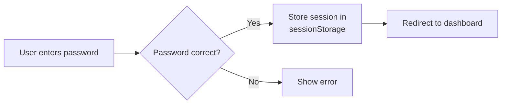

The system uses **simple password gates** — not user accounts. Everyone shares the same password per module.

| Gate | Password | Session Key | Scope |
|---|---|---|---|
| Dashboard | `tarabrooch` | `prisma_session` | Orders, Joyeros, Search |
| Pagos Module | `pagostara` | `prisma_pagos_session` | Expenses |
| Desglose Access | `desglosetara` | `prisma_desglose_session` | Payment breakdowns |

### Session Lifecycle

- **Storage:** `sessionStorage` (cleared when the browser tab closes)
- **Format:** `{ authenticated: true, timestamp: Date.now() }`
- **No expiration:** Sessions last until the tab is closed or user logs out
- **No user identity:** `Auth.getUserName()` always returns `null`

### Authorization Rules

| Action | Requirement |
|---|---|
| View/edit orders | Dashboard password |
| Create orders | Dashboard password |
| View/edit expenses | Pagos password (separate) |
| View/edit desglose | Desglose password (separate) |
| Create gold movements | Dashboard password (re-entered in modal) |
| All admin actions | Any authenticated session (no role differentiation) |

### Limitations

- No individual user accounts or per-user audit trails
- No role-based access control (everyone has full access once authenticated)
- Passwords are stored in plain text in `config.js` (client-side)
- No session timeout or token refresh
- `Auth.getUserName()` returns `null` — the `created_by` field in API calls is always `null`

---

## 9. Configuration System

All application configuration lives in `js/config.js` as a single frozen `CONFIG` object. This is the single source of truth for dropdowns, options, and business rules.

### Configuration Sections

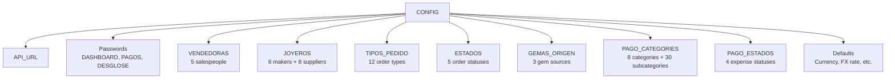

### Order Statuses Flow

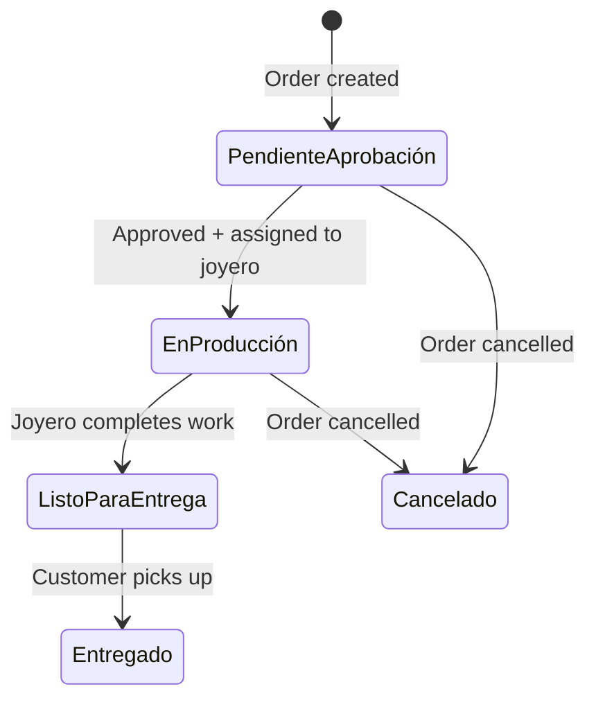

### Expense Statuses Flow

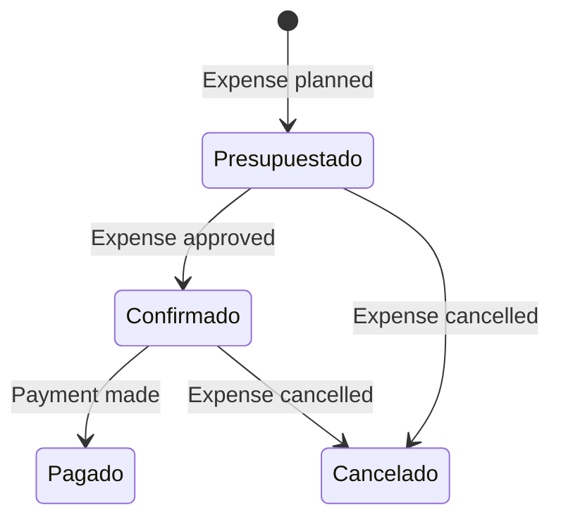

### Joyeros vs. Proveedores

The `JOYEROS` array contains two types of entries:

| Type | Example | Gold Tracking | Description |
|---|---|---|---|
| `joyero` | Carlos, Victor, Israel, Marcos, Salvador, Juan | Yes | In-house jewelry makers who receive gold |
| `proveedor` | A2, A30, A20, A99, A19, A14, A10, A6 | No | External suppliers (anonymized names) |

Proveedores are excluded from gold movement tracking — they do not receive gold from the store's inventory.

### Expense Categories

| Category Key | Display Name | Subcategories |
|---|---|---|
| `mercancia` | Mercancía / Inventario | Proveedor Oro, Plata, Gemas, Cadenas, Piedras, Hallazgos, Otro |
| `operacion` | Gastos de Operación | Renta, Luz, Agua, Internet, Teléfono, Limpieza, Mantenimiento, Seguridad, Seguros |
| `nomina` | Nómina | Sueldos, Bonos, Aguinaldo, IMSS, Infonavit, Comisiones |
| `servicios` | Servicios Profesionales | Contador, Abogado, Diseñador, Marketing, Joyero Externo, Consultoría |
| `impuestos` | Impuestos | ISR, IVA, Predial, Tenencia, Otros |
| `equipo` | Equipo y Herramientas | Herramientas de Taller, Equipo de Cómputo, Mobiliario, Maquinaria |
| `otros` | Otros Gastos | Papelería, Empaque, Envíos, Viáticos, Publicidad, Varios |
| `metodo_pago` | Tarjetas de Crédito | American Express, Visa, Mastercard, Transferencia, Efectivo, Otro |

---

## 10. Frontend Components

### Component Architecture

Components are plain JavaScript objects with `render()` methods that return HTML strings. They are not reactive — re-rendering is triggered manually by page controllers.

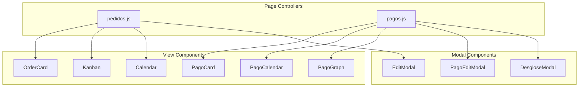

### Component Responsibilities

| Component | File | Renders | Key Logic |
|---|---|---|---|
| `OrderCard` | `order-card.js` | Order card in list view | Urgency indicators (4-day warning, overdue), saldo calculation |
| `Kanban` | `kanban.js` | Kanban board columns | Groups by status, collapsible completed/cancelled columns |
| `Calendar` | `calendar.js` | Monthly calendar grid | Dates colored by delivery deadline |
| `EditModal` | `edit-modal.js` | Order edit form | Abono (partial payment) tracking, all editable fields |
| `PagoCard` | `pago-card.js` | Expense card in list view | Status-colored badge, currency display |
| `PagoEditModal` | `pago-edit-modal.js` | Expense edit form | Status stepper, category/subcategory |
| `PagoCalendar` | `pago-calendar.js` | Expense calendar | Aggregation by date, FX conversion |
| `PagoGraph` | `pago-graph.js` | Spending chart | Category breakdown, FX-aware totals |
| `DesgloseModal` | `desglose-modal.js` | Payment breakdown form | Line items for credit card payment allocation |

### Rendering Pattern

```javascript
// All components follow this pattern:
const ComponentName = {
    render(data) {
        return `<div class="...">${data.field}</div>`;  // Returns HTML string
    }
};

// Page controller injects HTML:
container.innerHTML = items.map(item => Component.render(item)).join('');
```

---

## 11. Backend (Lambda Functions)

### Lambda Function Map

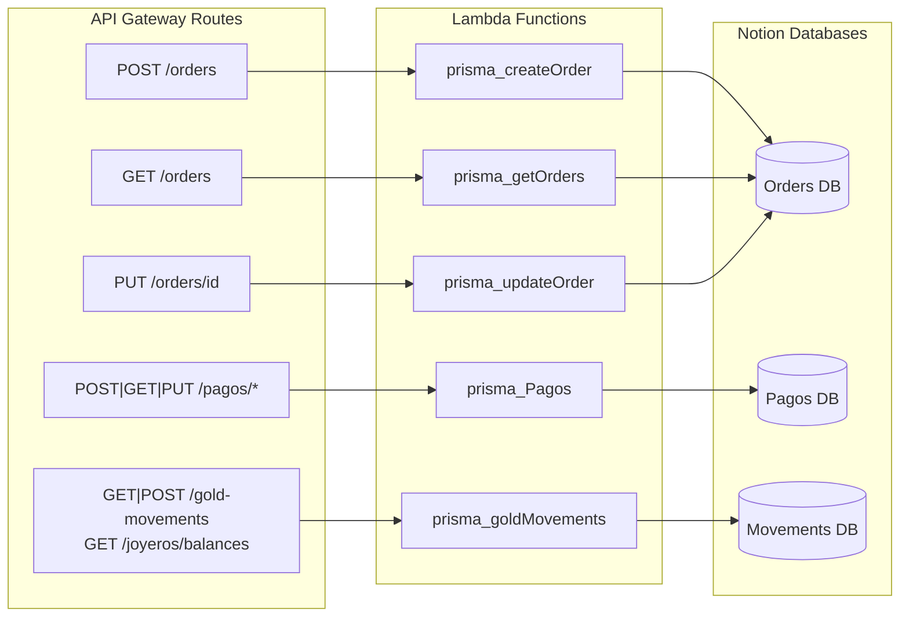

### Lambda Details

| Function | File | Runtime | Routes | Notion Operations |
|---|---|---|---|---|
| `prisma_createOrder` | `index.mjs` | Node.js (ESM) | `POST /orders` | `pages.create()` |
| `prisma_getOrders` | `index.mjs` | Node.js (ESM) | `GET /orders`, `GET /orders/search`, `GET /orders/{id}/content` | `databases.query()`, `blocks.children.list()` |
| `prisma_updateOrder` | `index.mjs` | Node.js (ESM) | `PUT /orders/{id}` | `pages.update()`, `blocks.children.append()` |
| `prisma_Pagos` | `index.mjs` | Node.js (ESM) | `POST/GET/PUT /pagos/*` | Full CRUD + desglose |
| `prisma_goldMovements` | `index.js` | Node.js (CJS) | `GET/POST /gold-movements`, `GET /joyeros/balances` | Query, create, paginated balance calc |

### Change Logging

Both the Orders and Pagos update Lambdas append change history to the Notion page as block children:

```
12:30 pm, 2026-01-15: Estatus cambiado a En Producción por Usuario
12:30 pm, 2026-01-15: Joyero actualizado por Usuario
```

This creates an immutable audit trail directly in each Notion page.

### Environment Variables

| Variable | Used By | Purpose |
|---|---|---|
| `NOTION_API_KEY` | createOrder, getOrders, updateOrder | Notion integration token |
| `NOTION_DATABASE_ID` | createOrder, getOrders | Orders database ID |
| `NOTION_TOKEN` | Pagos | Notion integration token (different env var name) |
| `PAGOS_DATABASE_ID` | Pagos | Pagos database ID |
| `NOTION_MOVEMENTS_DATABASE_ID` | goldMovements | Gold movements database ID |

---

## 12. Database Schema (Notion)

Notion serves as the database, with three databases:

### Orders Database

| Property | Notion Type | Description |
|---|---|---|
| `numero_orden` | Title | Order number (e.g., "1234") |
| `nombre_cliente` | Rich Text | Customer name |
| `telefono_cliente` | Rich Text | Customer phone |
| `tipo_pedido` | Select | Order type (anillo, aretes, etc.) |
| `descripcion` | Rich Text | Order description |
| `importe_total` | Number | Total amount (MXN) |
| `anticipo` | Number | Advance payment received |
| `estado` | Select | Current status |
| `estado_final` | Select | Final status (e.g., `cerrado_completo`) |
| `vendedora` | Select | Salesperson name |
| `joyero` | Select | Assigned jewelry maker |
| `oro_gramos` | Number | Gold weight in grams |
| `oro_con_joyero` | Checkbox | Gold delivered to jeweler? |
| `gemas_requeridas` | Rich Text | Gems needed |
| `gemas_origen` | Select | Gem source (Stock, Client, To Order) |
| `gemas_listas` | Checkbox | Gems ready? |
| `requiere_certificado` | Checkbox | Certificate required? |
| `fecha_pedido` | Date | Order creation date |
| `fecha_entrega_cliente` | Date | Customer delivery date |
| `fecha_entrega_tienda` | Date | Store target date |
| `fecha_fabricacion` | Date | Production start date |
| `notas` | Rich Text | Additional notes |

### Pagos Database

| Property | Notion Type | Description |
|---|---|---|
| `Name` | Title | Auto-generated: "categoria - subcategoria" |
| `monto` | Number | Amount |
| `moneda` | Select | Currency (MXN or USD) |
| `es_fiscal` | Checkbox | Has invoice? |
| `categoria` | Select | Expense category |
| `subcategoria` | Rich Text | Expense subcategory |
| `fecha_vencimiento` | Date | Due date |
| `estado` | Select | Status (presupuestado, confirmado, pagado, cancelado) |
| `descripcion` | Rich Text | Notes |
| `desglose` | Rich Text | JSON-encoded breakdown items |
| `creado_por` | Rich Text | Created by |

### Gold Movements Database

| Property | Notion Type | Description |
|---|---|---|
| `id` | Title | Auto-generated: "MOV-001" |
| `joyero` | Select | Jeweler name |
| `tipo_movimiento` | Select | Entrada, Salida Pedido, Salida Ajuste |
| `gramos` | Number | Weight in grams |
| `order_id` | Rich Text | Related order Notion ID |
| `numero_orden` | Rich Text | Related order number |
| `descripcion` | Rich Text | Movement description |
| `created_by` | Rich Text | Who recorded it |

---

## 13. Styling & Design System

### Design Tokens (CSS Custom Properties)

```css
/* Colors */
--primary: #2563eb;          /* Blue - primary actions */
--success: #10b981;          /* Green - positive states */
--warning: #f59e0b;          /* Amber - pending/warning */
--danger: #ef4444;           /* Red - errors/cancelled */
--gray-*: #f9fafb → #111827; /* 9-step gray scale */

/* Typography */
--font-family: 'Inter', sans-serif;
--font-sizes: 12px, 14px, 16px, 18px, 20px, 24px;

/* Spacing */
--spacing: 8px, 12px, 16px, 20px, 24px, 32px;

/* Borders */
--radius-sm: 8px;
--radius-md: 12px;
--radius-lg: 16px;

/* Shadows */
--shadow-sm: 0 1px 2px rgba(0,0,0,0.05);
--shadow: 0 1px 3px rgba(0,0,0,0.1);
--shadow-lg: 0 10px 15px rgba(0,0,0,0.1);
```

### Layout Strategy

| Element | Width | Description |
|---|---|---|
| `.container` | max 480px | Narrow forms (new order, new pago) |
| `.container-wide` | max 1200px | Dashboard views (orders, pagos, joyeros) |
| Cards | Responsive grid | CSS Grid with `auto-fill, minmax(320px, 1fr)` |
| Modals | 90% width, max 500px | Centered overlay with backdrop |

### Component Patterns

- **Cards:** White background, rounded corners, subtle shadow
- **Status badges:** Colored dots + text matching status color
- **Buttons:** Primary (blue), secondary (gray), danger (red)
- **Forms:** Labeled inputs with focus ring, error state (red border)
- **Toast notifications:** Fixed bottom-center, auto-dismiss after 3s
- **Loading overlay:** Full-screen with spinner

---

## 14. Deployment & Hosting

### Frontend Deployment

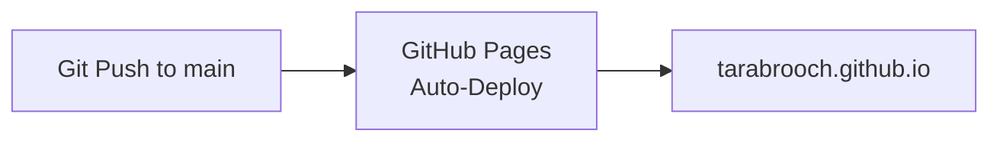

- **No build step** — files are served as-is (HTML, CSS, JS)
- Deployment is automatic on push to the default branch
- No minification, bundling, or transpilation

### Backend Deployment

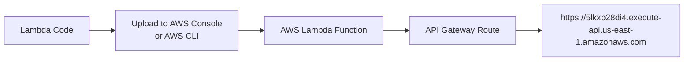

- Lambda functions are deployed independently
- Each function has its own `package.json` with `@notionhq/client`
- Environment variables are set in the AWS Lambda console
- CORS headers are included in every Lambda response

### Development Mode

Set `USE_MOCK_DATA = true` in `js/api.js` to use the mock data provider instead of real APIs. This enables:
- Full frontend development without AWS/Notion access
- 16 sample orders, 15 sample expenses, gold movements
- Instant responses (no network latency)

---

## 15. Limitations & Known Constraints

### Security

| Limitation | Impact | Severity |
|---|---|---|
| Passwords stored in client-side JS | Anyone can view source to see passwords | High |
| No individual user accounts | Cannot track who made which change | Medium |
| `Auth.getUserName()` returns `null` | `created_by` field is always null in API calls | Medium |
| No session expiration | Sessions last until tab closes | Low |
| CORS set to `*` on all Lambdas | Any origin can call the API | Medium |
| Notion API key fallback in source code | Key visible in Lambda source (should use env vars only) | High |

### Performance

| Limitation | Impact |
|---|---|
| All data loaded on each page load | Slow for large datasets; no pagination on frontend |
| Notion API pagination not fully handled on frontend | Only first page of results displayed for orders |
| Balance calculation paginates through ALL movements | Slow as movement history grows |
| No client-side caching | Same data re-fetched on navigation |
| No debounce on filter changes (except search) | Filter dropdown changes trigger immediate re-render |

### Data

| Limitation | Impact |
|---|---|
| Notion rich_text 2000-char limit per block | Desglose JSON must be chunked for large breakdowns |
| No relational integrity | Orders and gold movements are linked by text fields, not foreign keys |
| Movement count for ID uses full table scan | Gets slower as data grows |
| No data backup beyond Notion's own | Risk of data loss if Notion account is compromised |

### Functionality

| Limitation | Impact |
|---|---|
| No offline mode | Requires internet connection for all operations |
| No real-time updates | Users must refresh to see changes made by others |
| Single-tab design | Opening same page in multiple tabs may cause stale state |
| No undo/redo | Changes are immediately persisted |
| No bulk operations | Orders/expenses must be edited one at a time |
| Receipt printing requires pop-up | Browser pop-up blockers may interfere |

---

## 16. Boundaries of Concern

### What the System IS

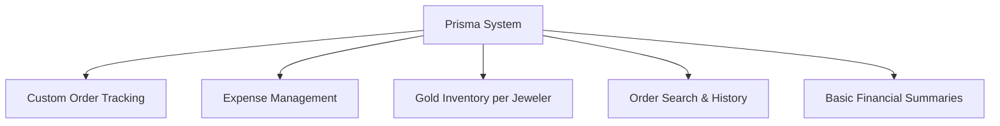

### What the System IS NOT

| Not Provided | Why |
|---|---|
| Point of Sale (POS) | No retail sales, inventory, or barcode scanning |
| Full Accounting | No general ledger, balance sheet, or P&L statements |
| CRM | No customer database, marketing, or follow-up |
| Multi-location Management | No per-location data separation |
| User Management | No individual accounts, roles, or permissions |
| Notifications | No email, SMS, or push alerts |
| Reporting/Analytics | No aggregated reports beyond calendar/graph views |
| Inventory Management | No SKU tracking, stock levels, or purchase orders (gold only) |

### Responsibility Boundaries

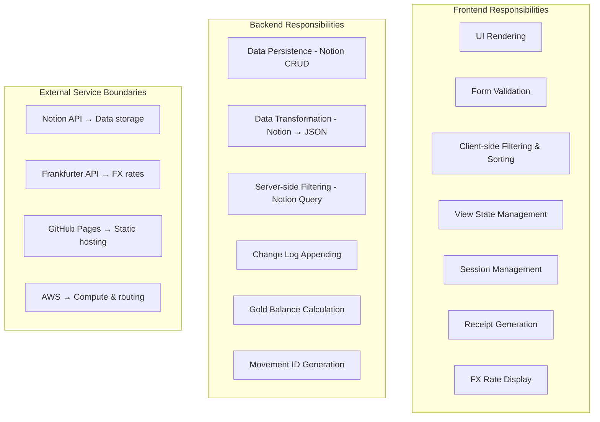

### Data Ownership

| Data | Stored In | Owned By |
|---|---|---|
| Orders | Notion Database | Backend Lambda reads/writes |
| Expenses | Notion Database | Backend Lambda reads/writes |
| Gold Movements | Notion Database | Backend Lambda reads/writes |
| Session State | Browser sessionStorage | Frontend only |
| Configuration | `config.js` (client-side) | Frontend only |
| FX Rates | Frankfurter API (live) | External service |

---

## 17. Future Roadmap

Based on `prisma_v2_plan.md`, the planned expansion includes:

### Migration to Supabase

| Current | Planned |
|---|---|
| Notion API (cloud NoSQL-like) | Supabase (PostgreSQL) |
| AWS Lambda | Supabase Edge Functions or direct SQL |
| No offline support | IndexedDB + sync for offline |
| Single location | Multi-location support |

### Planned New Modules

```mermaid
gantt
    title Implementation Phases
    dateFormat X
    axisFormat %s

    section Phase 1 - Critical
    Supabase Setup          :1, 2
    Inventory Management    :2, 4
    Point of Sale (POS)     :3, 5

    section Phase 2 - High
    Layaway (Apartados)     :5, 7
    Daily Tally (Corte)     :6, 8

    section Phase 3 - Medium
    Spending v2             :8, 10
    Reports / P&L           :9, 11

    section Phase 4 - Low
    Lost Customers          :11, 12
    Polish & Optimization   :12, 13
```

| Module | Purpose |
|---|---|
| **Inventory (SKU)** | 20K+ SKU tracking with barcode scanning |
| **POS** | Retail point-of-sale with receipt printing |
| **Layaway (Apartados)** | Installment payment tracking |
| **Daily Tally (Corte)** | End-of-day cash reconciliation per location |
| **Reports** | P&L, sales by category, inventory valuation |
| **Lost Customers** | Track why potential customers left without buying |

---

## 18. Glossary

| Term | Spanish | English Meaning |
|---|---|---|
| **Pedido** | Pedido | Custom jewelry order |
| **Pago** | Pago | Expense / payment |
| **Joyero** | Joyero | Jewelry maker (craftsperson) |
| **Proveedor** | Proveedor | External supplier |
| **Vendedora** | Vendedora | Salesperson |
| **Anticipo** | Anticipo | Advance payment / deposit |
| **Saldo** | Saldo | Remaining balance (total - anticipo) |
| **Abono** | Abono | Partial payment (installment) |
| **Desglose** | Desglose | Breakdown / itemization |
| **Estado** | Estado | Status |
| **Garantía** | Garantía | Warranty order (no charge) |
| **Oro** | Oro | Gold |
| **Gramos** | Gramos | Grams (unit of gold weight) |
| **Entrega** | Entrega | Delivery |
| **Fecha** | Fecha | Date |
| **Gemas** | Gemas | Gemstones |
| **Nómina** | Nómina | Payroll |
| **Corte** | Corte | Daily cash tally / reconciliation |
| **Apartado** | Apartado | Layaway |
| **Fiscal** | Fiscal | Related to tax invoices (facturas) |
| **Tipo de cambio** | Tipo de cambio | Exchange rate |

---

*Documentation generated from codebase analysis. For the latest code, refer to the repository at `tarabrooch.github.io`.*
